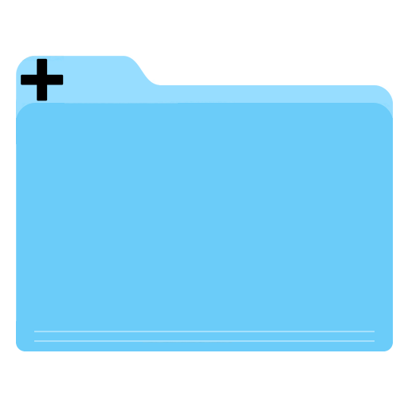

<h1>
      

         

           </a>

        

        
 
           Ultra TabSaver
          <h6>
            El mejor Tab Manager para Safari
          </h6>
        

      

</h1>

## Indice
- [Funcionalidades](#funcionalidades)
- [como usarlo](#como-usarlo)
- [como funciona?](#como-funciona)
- [Como ejecutarlo?](#como-ejecutarlo)
- [Lista de mejoras](#lista-de-mejoras)
- [Contribuir](#contributing)
- [Licencia](#licencia)
- [Gracias especiales](#gracias-especiales)
- **[README in english](README.md)**

## Update
- **[Video Promocional](https://www.youtube.com/watch?v=PNPAnn-jOCE)**
- **Gracias a todos por el feedback, voy a subir esta extension al AppStore en cuanto pueda**

## Funcionalidades
Esta extension agrega 3 caracterisitcas principales a Safari
* Salvar la pestaña actual
* Salvar todas las pestañas en una ventana
* Obtener una pestaña o un grupo de pestañas. En especifico para cada grupo de pestañas se agregan estas funcionalidades:
   * Abrir todas las pestañas con un solo click
   * Renombrarlo
   * Copiar todas las URL's
   * Agregar una URL
   * Eliminar el grupo
   * Eliminar una URL dentro de un grupo
   
   
## Como usarlo?
Al clickar el icono de la extension o hacer click derecho en cualquier parte del sitio web abrira este menu
* Save the current tab (salva la pestaña actual)
* Save all the tabs in a window (Salva toas las pestañas de la ventana seleccionada)
* Get All Tabs. (Al hacer click izquierdo en un grupo de pestañas se abriran todas, al hacer click derecho en un grupo de pestalas
se abrira este menu)
   * Copy to clipboard (se copian todas las URL's al portapapeles)
   * Add url to  the Tab Group. (abre un Textfield para ingresar una nueva URL)
   * Delete a Tab Group. (Elimina un grupo de pestañas)
   * Rename the Tab group (*Esta opcion es accesible solo clickeando desde el icono de la extension -> Get all Tabs -> Right click -> Rename)
* **Al hacer click derecho en una URL se puede acceder a las funcionalidades copiar al portapapeles y eliminar)**

   
## Como funciona?
Cuando seleccionas Save Tab/Save All tabs la extension obtiene las URL correspondientes y las guarda en NSUserDefaults.
Todas las URL son guardadas con una `key`, esa `key` es el nombre del grupo, por eso no pueden haber dos grupos con el mismo nombre.

## Como ejecutarlo?
Par compilar esta extension vas a necesitar caambiar las preferencias de Xcode para firmarlo utilizando tu propio sertificado, o no firmarlo. Para hacer eso debes ir a Xcode -> Targets ->UltraTabSaver Extension -> Signing certificate-> Develop o Sign to Run locally
En caso de no firmalo, deberas cambiar las preferencias de extensiones de Safari para habilitar "Allow Unsigned Extensions" desde el menu de 'Desarrolladores' de Safari. El menu de Desarrolladores puede ser habilitado desde Safari -> Preferencias -> Avanzado
Para mas informacion mirar este [link](https://blog.yimingliu.com/2018/11/14/notes-on-porting-a-safari-extension-to-a-safari-app-extension/) especialmente en **How to debug**. Si necesitas mas ayuda abri un issue y voy a brindar una guia paso a paso de como hacerlo

## Lista de mejoras
- Mejorar la performance (Al clickear el icono de la extension tarda 3 segundos en mostrar el pop up)
- Compilarlo y subir esta extension al App Store (Si a alguien le resulta util esta extension la subo al App Store)
- Permitir drag and drop URL a traves de los Groups.
- Permitir key shortcuts.

## Contribuir

#### Paso 1

- **Opcion 1**
    - 🍴 Forkear este repo!

- **Opcion 2**
    - 🐑 🐑 Clonar este repo en tu computadora local usando el comando `git clone https://github.com/morsamatias/UltraTabSaver.git`

#### Paso 2

- **Hace tu mejora!** 🔨🔨🔨

#### Step 3

- 🔃 Crear una nueva Pull Request usando<a href="https://github.com/morsamatias/UltraTabSaver/compare/develop...yourbranch" target="_blank">`https://github.com/morsamatias/UltraTabSaver/compare/`</a>.

## Licencia

- **[GPL-2.0](https://www.gnu.org/licenses/old-licenses/gpl-2.0.en.html)**
- Copyright 2020 © <a href="http://matias.morsa.com" target="_blank">Matias Morsa</a>.
- Este proyecto es y siempre va a ser open-source
---
## Gracias especiales a:
- [panicsteve/my-first-safari-extension](https://github.com/panicsteve/my-first-safari-extension)
- [fvcproductions/sampleREADME.md](https://gist.github.com/fvcproductions/1bfc2d4aecb01a834b46)
- [How to Create a Safari Extension from Scratch](https://blog.yimingliu.com/2018/11/14/notes-on-porting-a-safari-extension-to-a-safari-app-extension/)
